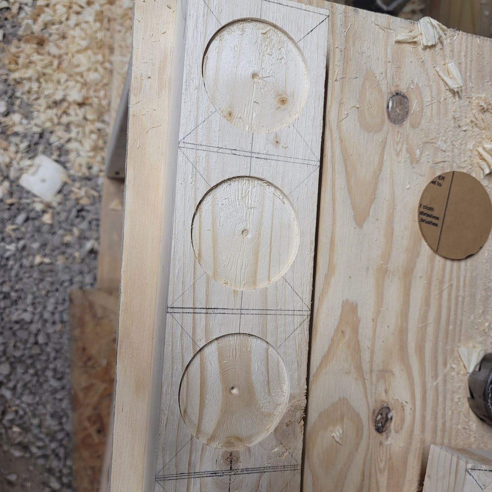

# GGD_Streamer LED System

A Raspberry Pi-powered LED lighting display synchronized with internet streamers with a focus on Twitch but support for other more, risqué, content. Each LED node can be individually configured with display modes and effects.

## Features

- Real-time Twitch stream monitoring
- Optional checks for adult content presence (via public APIs)
- Per-node display configuration (color, effect, mode)
- Streamer-independent display mode (no internet required)
- Integrated .NET Web UI for color/effect configuration
- SignalR-based push updates to clients
- WS2811 LED support using GPIO on Raspberry Pi

## Showcase
### 🔧 Custom LED Nodes
Fun youtube edit 

[](https://youtu.be/uYOQbDJsaW0 "Gamersupps Display Showcase")

Each node is built using WS2811-compatible RGB LEDs using DYImall 7LED Jewels, allowing for granular control and unique display modes per streamer or independent effect.
Any addressable LED light will work for this, my custom nodes were built with a halleffect sensor input for a magetically activated led effect. which has not be implemented in this version of the GGD stand


### 🖼️ Display Stand

The display is mounted in a handcrafted stand with 16 neatly spaced node slots, cable management, and access to Raspberry Pi ports for power and debugging.


### 🎇 Live Demo

Watch the lights pulse to life when streamer mode is enabled.


## Project Structure

- **GGD_Display**: ASP.NET Core web interface to configure node settings, colors, and linked streamers.
- **TwitchAPI.dll**: Class library for fetching Twitch streamer status.
- **led_controller.py**: Python script running on Raspberry Pi to control WS2811 LEDs via GPIO.
- **save.json**: Stores persistent configuration for streamers and node mappings.

## Requirements

### Hardware

- Raspberry Pi Gen4/Zero2 or above (any model with GPIO support)
- Due to ARM7L support for .Net
- Python Flask will support older models.
- WS2811-compatible LED strip
- Power supply for LEDs
- 
<details>
  <summary><strong>🔧 Parts & Links (Click to Expand)</strong></summary>

  <br/>

  Below are the core components used to build this project: I get no money for sharing these items, if cheaper elsewhere, tell me cause these get expensive 

  | Part                            | Description                                            | Link |
  |---------------------------------|--------------------------------------------------------|------|
  | **WS2811 RGB LED Node**       | Individually addressable LED strip (5V logic level)    | [Buy on Amazon](https://a.co/d/6ISCJoT) |
  | **Raspberry Pi (4/zero2+ Models)**   | Controls the LEDs and runs the Python script           | [Official Site](https://a.co/d/5F31hkN) |
  | **Custom Made Stand**          | Holds all 16 nodes in a structured display             | _Homemade — no commercial link_ |
  | **Custom LED Node**      | Holds the DIYMall Jewel LED and simplifies wiring            | _Homeade _ no commercial link_ looking into how to share these files or custom order if wanted about $100 usd for 36 (including shipping) 36 Nodes makes 2 stands with 4 spares |
  | **Jumper Wires & Connectors**  | Wiring between Pi, power, and LED strip                | [Buy on Amazon](https://www.amazon.com/dp/B07...) |
  | **MicroSD Card (16GB+)**       | Storage for Raspberry Pi OS and controller script any size that can store a raspberry pi os is fine      | [Buy on Amazon](https://a.co/d/i84zci7) |

</details>


### Software

- .NET Core 3.1+ (for Web App)
- Python 3.9+
- Required Python packages:
  - `rpi_ws281x`
  - `signalrcore`
  - `requests`

## Configuration

1. **Web Interface**:
   - Configure colors, effects, and streamer links via the UI.
   - Toggle `Streamer Mode` and `Adult Check Mode`.

2. **`appsettings.json` (ASP.NET)**:
   ```json
   {
     "EnableStreamerMode": true,
     "EnableAdultCheck": false
   }

### Steps 
# Each measurement is exact (2x4 boards are accually 3.5 by 1.5 inch) I cut boards down the measurements I needed.
## Here is brief of what I did to make this

Step 1a: mark out on a 4in by 1.5in board the center for 8 cups, each cup has a max width of 4in, the base is just shy of 3in.
First hole is shallow (3mm) at 3 inches wide
Second hole is 1.2 inch deep by 2 9/16ths this ledge is what holds the arylic disc. 



Step 2 (not pictured) is to drill wiring holes in the back, Router out a channel that connects the holes to the center of the cut outs.
Also sand and stain the wood

Step 3 route wires, each node has 3 going in 3 going out fished into the next node for series connections. 
The extra 8 wires here is for the megnetic signal that I am working on for the tubs (or a coaster for a cup)


Step 4a: mount the light nodes, I am using my custom PCB board but using the circular one from above would work here as well (my nodes have the megnatic detection in them is really the only differance)
Step 4b: place the 3in aryilic disks into the holes, They should fit flush with the top of the board, If not sand down or place something in the space if you cut too deep. (can also sand down to the right measurement if not stained yet)


Step 4: (Optional) I sanded the clear arylic disks to give them a frosted look and notched them by sanding away a side of the circle so I can replace nodes easier during prototyping.


